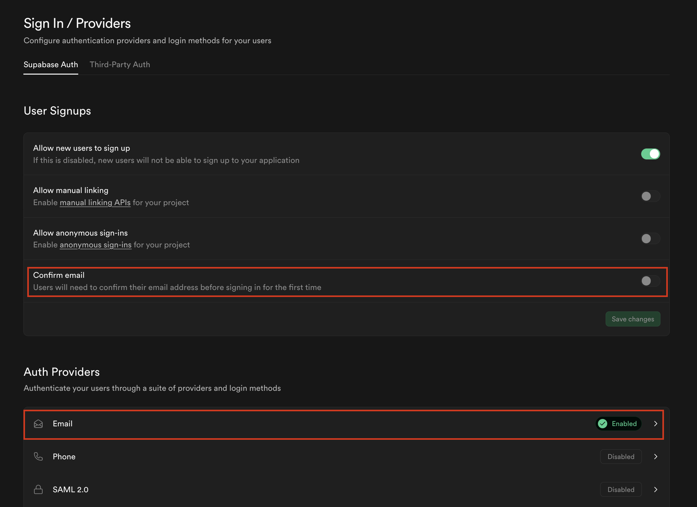
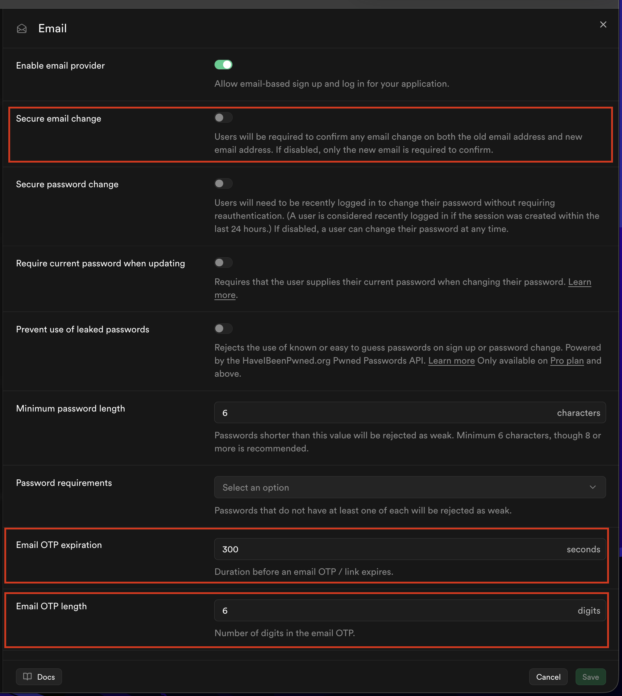
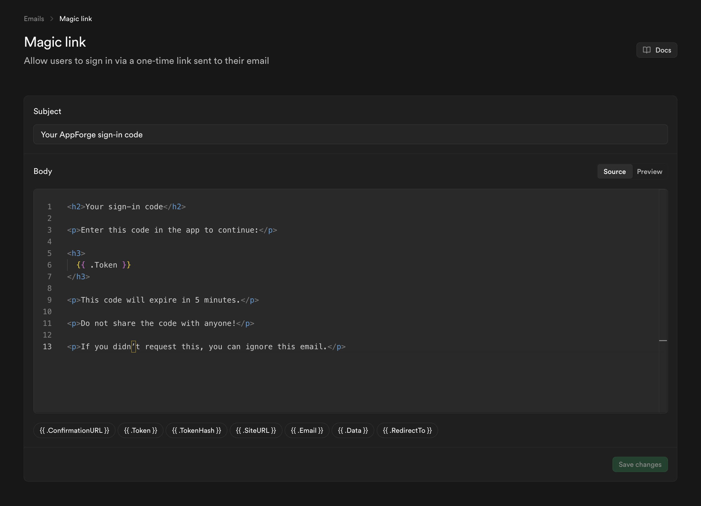

# Supabase Setup

This document outlines how Supabase DB needs to be configured for the template.

## Authentication Configuration

### Sign In / Providers





#### Login Method

Setup above allows for OTP via emails as the primary authentication method.

## SMTP Templates

Update the SMTP template to match the current project.



## Script Execution

### Profiles Table

The `profiles` table extends `auth.users` with application specific user data.

#### Schema

- `id` → UUID (references `auth.users.id`)
- `email` → copied from auth
- `first_name`
- `last_name`
- `onboarded` → boolean flag for onboarding completion
- `created_at`
- `updated_at`

#### Table Creation

```sql
-- create profiles table
create table public.profiles (
  id uuid primary key references auth.users(id) on delete cascade,
  email text not null,
  first_name text,
  last_name text,
  onboarded boolean not null default false,
  created_at timestamptz not null default now(),
  updated_at timestamptz not null default now()
);
-- enable rls
alter table public.profiles enable row level security;
```

### Automatic Profile Creator Trigger

```sql
-- auto create profile method
create or replace function public.handle_new_user()
returns trigger as $$
begin
  insert into public.profiles (id, email)
  values (new.id, new.email);

  return new;
end;
$$ language plpgsql security definer;
-- trigger
create trigger on_auth_user_created
after insert on auth.users
for each row
execute function public.handle_new_user();
```

### RLS Policies

```sql
-- users can read their own profiles
create policy "Users can view their own profile"
on public.profiles
for select
using (auth.uid() = id);
-- user can update their own profiles
create policy "Users can update their own profile"
on public.profiles
for update
using (auth.uid() = id);
```

### Auto Update `updated_at` Trigger

```sql
-- auto update updated_at method
create or replace function public.update_updated_at()
returns trigger as $$
begin
  new.updated_at = now();
  return new;
end;
$$ language plpgsql;
-- trigger
create trigger update_profiles_updated_at
before update on public.profiles
for each row
execute function public.update_updated_at();
```

## Expected Flow

1. User signs in via OTP
2. Supabase creates a new `auth.users` record (if the users new)
3. Trigger automatically creates a corresponding `profiles` row
4. App checks `profiles.onboarded`
   - If `false` --> redirect to onboarding
   - If `true` --> allow access to app

## Notes

- Profiles are created automatically via the trigger so no manual inserts required. They also automatically get deleted when the entry is deleted in auth
- Email is duplicated from auth schema for convenience
- `onboarded` determines whether a user should complete onboarding first before being given access to the main app
- Additional project specific data should be stored in a separate table and not inside `profiles`

## Setup Outcome

- ✅ Auth works
- ✅ Profiles always exist
- ✅ Data is secured by RLS
- ✅ Onboarding has a clear entry point
